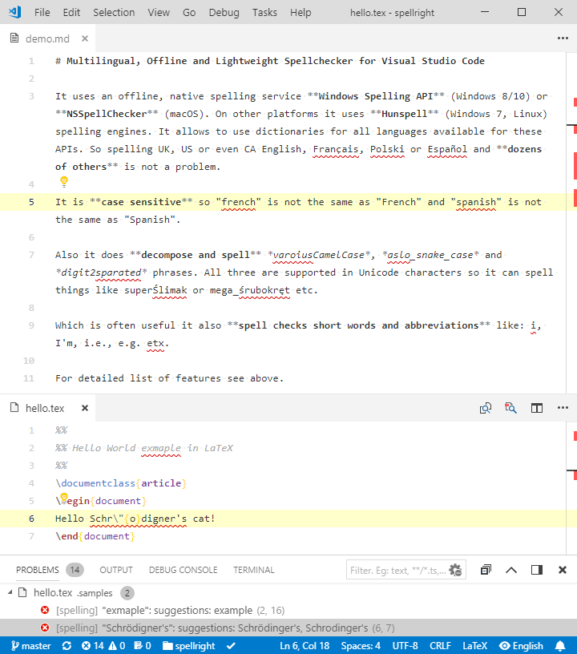
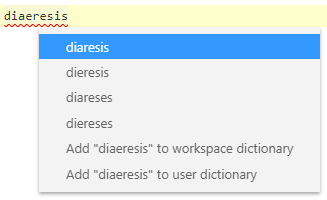
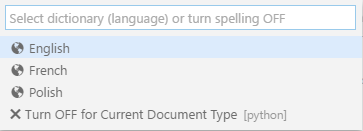
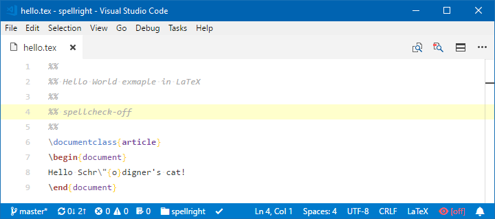
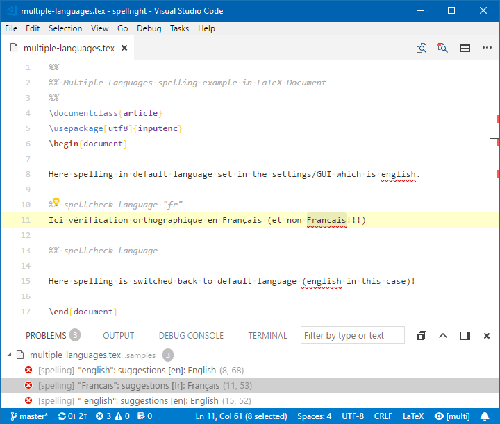
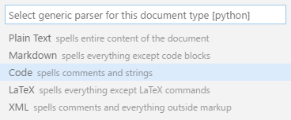

# Multilingual, Offline and Lightweight Spellchecker for Visual Studio Code

[](https://marketplace.visualstudio.com/items?itemName=ban.spellright)
[](https://marketplace.visualstudio.com/items?itemName=ban.spellright)
[](https://marketplace.visualstudio.com/items?itemName=ban.spellright) [](http://opensource.org/licenses/MIT)

## Features

* Spells **plain text**/**markdown**/**LaTeX** documents, **comments**/**strings** parts of most **source code** (C++, C, Python, JavaScript, Batch, ..., D, Julia etc.) documents and **text**/**comment** nodes on **XML**/**HTML** class documents.
* Supports **every language** that can be used with either of the below mentioned native spelling engines (e.g. **all languages** that are available in Microsoft Office, see [here](https://docs.microsoft.com/en-us/windows-hardware/manufacture/desktop/available-language-packs-for-windows), **multiple languages** in Windows Single Language editions, like [here](https://github.com/bartosz-antosik/vscode-spellright/issues/23#issuecomment-314038083) etc.)
* Supports use of multiple workspace plaintext file dictionaries which may be used for specialized vocabularies like **medical terms**, **trademark names** etc.
* Spelling documents' syntactic elements e.g. **comments**/**strings** in **different languages** (e.g. strings spelled in English and comments spelled in French).
* Spelling of **multiple languages in one document** either by selecting more than one language for spelling or using In-Document commands to switch between languages.
* **Case sensitive** which means that it will distinguish between *english* and *English*, *french* and *French* and which is critical in some western languages like e.g. German.
* Spells, among others, **short words**, **abbreviations**, **contractions** (*I*, *I'm*, *I'll*, *i.e.*, *doesn't*, *etc.*) and parenthetical plurals (*word(s)*, *process(es)*, etc.)
* Spells **CamelCase**, **snake_case** and **digit2inside** compound phrases respecting Unicode capital/small letters distinction (e.g.: *SuperŚlimak* is spelled as *Super* *Ślimak*) and capital letter adhesion (e.g.: *HTMLTest* is spelled as *HTML* *Test*).
* Unobtrusive **GUI**/**command** interface for switching spelling dictionary (language) and turning spelling ON/OFF for particular document class.
* **In-Document commands** allow to switch spelling **ON** or **OFF** despite global settings and **change spelling language** multiple times within the document.
* Small memory & CPU usage footprint - uses **offline**, **OS native** spell checking backends: Windows Spell Checking API (windows 8/10), NSSpellChecker (macOS) and Hunspell (Linux, Windows 7).
* Extension uses **background processing** (on idle) and **differential edit notifications** to minimize area spelled during editing only to lines touched by changes.

## Installation

Search for *Spell Right* from the extension installer within VSCode or execute below line in the **command palette** (<kbd>F1</kbd> or <kbd>Ctrl</kbd>+<kbd>Shift</kbd>+<kbd>P</kbd>):

```PowerShell
ext install spellright
```

Spell Right requires spelling back-end which is different for various platforms. Please read carefully the section below on how to provide dictionaries for Spell Right to work properly.

If you have any problem with installation or you see that Spell Right does not work with some type of document please read carefully the lengthy README file below and if nothing seems to be related to the problems you face post an issue [here](https://github.com/bartosz-antosik/vscode-spellright/issues).

## Dictionaries

### **Windows 8+**

On Microsoft Windows from version 8 on Spell Right uses system spelling API. Follow system guidelines, like [here](http://www.tech-recipes.com/rx/56333/windows-10-change-or-add-another-language/) or [here](https://docs.microsoft.com/en-us/windows-hardware/manufacture/desktop/add-language-packs-to-windows), on how to install additional system spelling dictionaries.

### **macOS**

On macOS Spell Right uses system spelling API.

### **Linux and Windows 7**

On Linux and Windows 7 Spell Right uses built in *Hunspell* spell checker library. To use it a pair of Dictionary (\*.dic) and Affixes (\*.aff) files with **UTF-8 encoding** have to be downloaded (remember to download RAW files) e.g. from [here](https://github.com/titoBouzout/Dictionaries) (multiple languages), [here](https://github.com/gusbemacbe/LanguagePortuguese) (Portuguese) or [here](https://github.com/superbob/SublimeTextLanguageFrench) (French) and placed in `Dictionaries` subfolder of VSCode's user global configuration directory, located at:

* **Windows:** `%APPDATA%\Code\Dictionaries\`
* **Linux:** `$HOME/.config/Code/Dictionaries/`

`Dictionaries` subfolder does not exists there by default and has to be created manually.

In case you run *Insiders* edition of VSCode then `Code` part of the path has to be changed to `Code - Insiders` appropriately.

Spell Right cannot automatically match the dictionary name with system locale settings when using *Hunspell* dictionaries hence **at first run dictionary has to be selected manually** (e.g from status bar).

On most Linux distributions system-wide dictionaries can be reused (for now only UTF-8 encoded dictionaries are supported, verify `SET` line in \*.aff file) by soft linking the system folder e.g.:

```bash
ln -s /usr/share/hunspell ~/.config/Code/Dictionaries
```

Dictionaries from the folder will be listed in the language selection list and used for spelling documents. Because *Hunspell* engine is slower in serving suggestions to misspelled words it may be useful to set `spellright.suggestionsInHints` to `false` which will speed spelling up and suggestions will still be available in context menu called upon action for the suggestion.

### **User Dictionaries**

Spell Right stores words considered as spelled correctly and not existing in the main spelling engine (a.k.a. ignored words) in plaintext dictionary files. All the extension's commands add words to two main files, user and workspace dictionaries, both contained in `spellright.dict` files, one located in user settings folder and the other in workspace settings folder (`.vscode`). Besides these there can be any number of `*.dict` files in workspace settings folder e.g. dictionaries containing specialized vocabularies like **medical terms**, **trademark names** etc. User dictionary is always used and workspace dictionaries are used in the context of opened folder. All provided dictionaries are used in conjunction.

### **Symbols in Source Code Documents**

When spelling source code class of document which provides symbol information for the document (e.g. the symbols which are used when <kbd>Ctrl</kbd>+<kbd>Shift</kbd>+<kbd>O</kbd> is pressed to perform GoTo symbol operation) the symbols are used for spelling of the document. It reduces the number of false spelling warnings mostly in comments which provide source code documentation on the usage of these symbols, e.g. variables, function parameters etc.

## Screenshots

### Documents

Spelling of **plain text**/**markdown**/**LaTeX** documents:



### Source Code & Markup Documents

It can spell *strings*/*comments* parts of most **source code** (*C++*, *Python*, *JavaScript*, *Batch* and lots of others) and *text*/*comment* nodes on **XML**/**HTML** class documents:


## Usage

### Correcting Spelling Errors

Press **<kbd>Ctrl</kbd>+<kbd>.</kbd>** (Windows, Linux) **<kbd>⌘</kbd>+<kbd>.</kbd>** or **<kbd>Cmd</kbd>+<kbd>.</kbd>** (macOS) or click *Lightbulb* to show a context **menu with suggestions**:



Use **<kbd>F8</kbd>** or **<kbd>Shift</kbd>+<kbd>F8</kbd>** to jump to **next**/**previous** spelling error.

### Changing Language and Turning OFF

Extension has a handy list interface for switching spelling dictionary (language) or turning spelling OFF for currently open document type:



It can be reached by clicking on indicator field with an "eye" symbol in status bar:


Alternatively same result can be achieved selecting command `SpellRight: Select Dictionary (Language)` or `SpellRight: Turn OFF for Current Document Type` from the **command palette** (**<kbd>F1</kbd>**/**<kbd>Ctrl</kbd>+<kbd>Shift</kbd>+<kbd>P</kbd>**).

Status bar indicator also shows when spelling for particular document class has been turned OFF:


Or when it has been forced OFF by In-Document command (`spellcheck&#x2d;off`) or rule in `.spellignore`:



### Multiple languages in one document

Language selector allows to select more than one language. Document is then spelled using all of the dictionaries and when a token (word) is considered correct **in one of the dictionaries** it is considered as spelled correctly. When it is not, then suggestions for all selected languages are shown.

Language can also be switched by using In-Document command <code>spellcheck&#x2d;language</code> placed within document:



And when at least one language spelled is missing dictionary:


## Commands

This extension contributes the following commands:

`SpellRight: Select Dictionary (Language)`

Pops dictionary selection list. Selecting language also turns spelling ON. The list also allows to turn spelling OFF for currently open document type. Can also be reached by clicking indicator field in status bar.

`SpellRight: Turn OFF for Current Document Type`

Turn spelling OFF for currently open document type.

`SpellRight: Open User Dictionary File`

Open in editor `spellright.dict` file from user settings folder.

`SpellRight: Open Workspace Dictionary File`

Open in editor `spellright.dict` file from workspace settings folder (`.vscode`) appropriate for currently open document in (multi root) workspace.

`SpellRight: Add Selection to Workspace Dictionary`

Add text selected in editor to main workspace dictionary appropriate for currently open document in (multi root) workspace.

`SpellRight: Add Selection to User Dictionary`

Add text selected in editor to main user dictionary.

`SpellRight: Update Configuration`

Saves current state of GUI (that is language and map of documents classes spell checked) to appropriate configuration file. Works only if `"spellright.configurationUpdate"` is set to `false`.

## Settings

This extension contributes the following settings (with default values):

`"spellright.language": [ "" ]`

Default language (dictionary/country name) used for spelling. Typically in a LANGUAGE (e.g.: "en", "fr", when `"spellright.groupDictionaries"` is `true`) or LANGUAGE-COUNTRY format (e.g.: "en-US", "en-GB", "fr-CA", "pl-PL", when  `"spellright.groupDictionaries"` is `false`). When *Hunspell* spelling engine is used (e.g. in Windows 7) this setting should be the name of the dictionary file without extension. In case `language` parameter is not set then language from OS locales is used.

`"spellright.statusBarIndicator": true`

Enable/disable language & status indicator switch in status bar.

`"spellright.suggestionsInHints": true`

Enable/disable including suggested corrections in hints. Disabling suggestions significantly speeds checking up. May be useful in case of large, often switched or saved documents.

`"spellright.addToSystemDictionary": false`

When `true` words added to user dictionary are stored in system default custom spelling dictionary instead.

`"spellright.groupDictionaries": true`

Enable/disable grouping of dictionaries by language. Disabling grouping results in displaying dictionaries for all regional variants (e.g. en-US, en-GB, en-CA etc.) as separate entries. When enabled regional dictionaries are displayed as single dictionary under common language name (e.g. "English"). Works only on native Windows & macOS spelling APIs.

`"spellright.recheckOnSave": false`

Enable/disable re-checking of entire document after file is saved.

`"spellright.documentTypes": [ "plaintext", "markdown", "latex" ]`

Document types for which spelling will be turned ON by default.

`"spellright.ignoreRegExps": []`

Regular expressions ignored in spelling. Allows to ignore/consider as spelled correctly generalized expressions. Works on raw document **before** separating words to spell which allows to ignore larger parts of the document. Regular expressions have to be in double quoted JavaScript regular expression format. That is backslash has to be quoted as well e.g.: `"/(\\.?)(gif|png)/g"` to ignore file extensions like `".gif"` and `".png"`.

`"spellright.ignoreRegExpsByClass": {}`

Extends setting of `"spellright.ignoreRegExps"` per document type. Accepts object of key-multi-value pairs. For example following settings:

```JSON
"spellright.ignoreRegExpsByClass": {
    "markdown": [ "/&amp;/g", "/&nbsp;/g" ],
    "cpp": [ "/#include\\s+\\\".+\\\"/g" ],
    "html": [ "/<script>[^]*?</script>/gm" ],
    "latex": [ "/\\\\begin{minted}[^]*?\\\\end{minted}/gm" ]
}
```

* avoid spelling of `&amp;` and `&nbsp;` literals in markdown documents;
* avoid spelling of strings in `#include "file"` construct in CPP documents;
* avoid spelling of multiline `<script></script>` tag content in HTML documents;
* avoid spelling of "minted" code blocks in LaTeX documents.

Please mind the fact that both `"spellright.ignoreRegExps"` and `"spellright.ignoreRegExpsByClass"` **may have serious impact on performance**. They are applied on whole document before every, even smallest spell check, has to reapply these filters so they may cost time in complicated expressions.

`"spellright.ignoreFiles": [ "**/.gitignore", "**/.spellignore" ]`

Set of file patterns to globally, silently exclude files from being spelled. Files described with this setting will not be reported as forced OFF spelling (red indicator in status bar). Patterns defined as for [gitignore](https://git-scm.com/docs/gitignore).

`"spellright.notificationClass": "error"`

Allows to change class of diagnostic messages produced by Spell Right which changes in turn underline color. Possible values (with corresponding underline color) are: `"error"` (red), `"warning"` (green), `"information"` (green), `"hint"` (invisible).

`"spellright.notificationClassByParser": {}`

Extends `"spellright.notificationClass"` to allow change class of diagnostic messages per parser. For example following settings:

```JSON
"spellright.notificationClassByParser": {
    "code": "information"
}
```

will produce `"information"` class diagnostics for documents spelled with `code` parser. Possible values on left side of the association are: `plain`, `markdown`, `code`, `latex` and `xml`.

`"spellright.spellContext": "body comments strings"`

Allows to enable (present in string) or disable (absent in string) spelling of syntactic parts of the documents. Currently supported are:

* `body` - body of document (e.g. LaTeX, Plaintext, Markdown etc.);
* `code` - code blocks in Markdown type documents (spelled as whole, not syntactically);
* `comments` - comment (block & line) sections in programming languages, also LaTeX;
* `strings` - strings in programming languages.

`"spellright.spellContextByClass": {}`

Same as `"spellright.spellContext"` but per document type. Accepts object of key-value pairs. For example following settings:

```JSON
"spellright.spellContextByClass": {
    "latex": "body",
    "cpp": "comments",
    "python": "strings"
}
```

* disable spelling of comments in LaTeX documents;
* disable spelling of strings in CPP documents;
* disable spelling of comments in Python documents.

`"spellright.languageContext": {}`

Allows to decide on which language is used to spell syntactical parts of the documents. For example following settings:

```JSON
"spellright.languageContext": {
    "strings": [ "en-US" ],
    "comments": [ "en-GB" ]
}
```

will spell strings in *American English* and comments in *British English* of course if the `"spellright.groupDictionaries"` flag is set to `false`.

Configuration item `"spellright.languageContext"` is more important than `"spellright.language"` but less important than In-Document commands.

`"spellright.languageContextByClass": {}`

Same as `"spellright.languageContext"` but per document type. For example following settings:

```JSON
"spellright.languageContextByClass": {
    "latex": {
        "body": [ "fr" ],
        "comments": [ "en" ]
    }
}
```

will spell body of `latex` documents in *French* and comments in *English*.

Configuration item `"spellright.languageContextByClass"` is more important than `"spellright.language"` and `"spellright.languageContext"` but less important than In-Document commands.

`"spellright.configurationUpdate": true`

If set to true then each operation on the GUI (change of language, turning spelling OFF for particular document type) is automatically saved in appropriate configuration settings (workspace if workspace is open and user if not). Setting to false requires using of `"spellright.configurationUpdate"` command to save the changes performed in GUI.

`"spellright.configurationScope": "workspace"`

Allows to decide which configuration gets updated when `"spellright.configurationUpdate"` is set to true. Possible values are `user` and `workspace`.

`"spellright.latexSpellParameters": (see below for default value)`

Defines LaTeX commands that should have both mandatory (`[]`) and optional (`{}`) parameters spelled. Other commands are removed from spelling. Default value:

```JSON
"spellright.latexSpellParameters": [
    "author",
    "title",
    "date",
    "chapter",
    "section\\*?",
    "subsection\\*?",
    "subsubsection\\*?",
    "part",
    "paragraph",
    "subparagraph",
    "text(rm|sf|tt|md|bf|up|it|sl|sc|normal)",
    "underline",
    "emph",
    "item",
    "footnote(text)?",
    "caption(of)?",
    "multicolumn",
    "href",
    "hyperref",
    "begin\\{frame\\}"
]
```

`"spellright.parserByClass": {}`

Allows to assign or override generic parser for particular document class. For example following settings:

```JSON
"spellright.parserByClass": {
    "perl": {
        "parser": "code"
    }
}
```

assigns parser of generic type `code` (Source Code Parser) to `perl` (Perl) document class. Possible values are:

* `plain` - spells entire content of the document;
* `markdown` - spells everything except code blocks;
* `code` - spells comments and strings;
* `latex` - spells everything except LaTeX commands;
* `xml` - spells comments and everything outside markup.

`"spellright.useDocumentSymbolsInCode": true`

If set to true Spell Right will use document symbols (variable, function names etc.) when spelling source code documents. Significantly reduces number of misspelled words in doc-strings and in comments whenever a symbol used in code is used and the symbol does not disassemble to properly spelled parts using CamelCase, snake_case etc. separation.

## In-Document Commands

Beside global settings following commands can be embedded inside spelled parts of the document (e.g.: comments, strings etc.):

<code>spellcheck&#x2d;language&nbsp;"CODE" ["CODE"]\*</code> (alternative syntax: <code>spellcheck:&nbsp;language&nbsp;"CODE" ["CODE"]\*</code> and `!TEX spellcheck = "CODE"`, but with only one language code in comment areas of `latex` document class only)

Forces **switching spelling language** for the following part of the document or until next <code>spellcheck&#x2d;language&nbsp;"CODE"</code> command. `CODE` is language code according to used spellcheck background service, typically in a LANGUAGE or LANGUAGE-COUNTRY format (e.g.: "en", "fr", "en-US", "en-GB", "fr-CA", "pl-PL" etc.) If `CODE` is empty switches **back to default spelling language**.

In-Document commands for switching spelling language have highest priority over `"spellright.languageContextByClass"` and `"spellright.languageContext"` and `"spellright.language"` configuration items.

`spellcheck&#x2d;off` (alternative syntax: `spellcheck: off`)

Forces spelling **OFF** for the entire document despite global settings.

`spellcheck&#x2d;on` (alternative syntax: `spellcheck: on`)

Forces spelling **ON** for the entire document despite global settings. Has higher priority than turning spelling off with both *In-Document* `spellcheck&#x2d;off` command and `.spellignore` patterns.

## Ignore file

`.spellignore` file located in workspace root directory, appropriate to currently open file in (multi root) workspace, can be used to disable spelling for files described by [gitignore](https://git-scm.com/docs/gitignore) syntax file patterns.

## Unknown document type

Spell Right must have an idea of the document structure in order to be able to spell it. Most document types have parts that do not need to be spelled (e.g. code blocks in Markdown, commands in LaTeX documents etc.) When an unregistered document type is encountered then Spell Right proposes a list of generic parsers to choose from:



Select appropriate class to be able to spell the document. If `spellright.configurationUpdate` is set to `true` assignment will be written to the configuration settings either user or workspace according to the value of `spellright.configurationScope` setting.

## Known Issues

* Hint box associated with "Bulb" Code Action has an ugly habit of wrapping text at certain width not at white/punctuation character thus suggestions got cut in weird places (this is probably more of a VSCode's issue).
* There is a limit, imposed by VSCode, on the number of diagnostics that an extension (Spell Right among) can provide for one file. The number is 1000 and Spell Right cannot display more spelling errors. Once the spelling errors from the head of the file are corrected or added to the dictionaries more issues will appear at the end.
* Due to [bug](https://stackoverflow.com/questions/31214926/how-to-add-language-to-nsspellcheckers-available-languages) in `NSSpellChecker` layer of macOS Spell Right cannot currently use dictionaries installed in `~/Library/Spelling` folder, just those that came with the system.
* There are rare situations when dictionaries are not reported correctly on Windows using Windows Spelling API (Windows 8+). They can result in no dictionary or only some dictionaries available. So far the reason for this is unknown but seems to be outside of the extension (see [#106](https://github.com/bartosz-antosik/vscode-spellright/issues/106) and [#53](https://github.com/bartosz-antosik/vscode-spellright/issues/53) for details).

## Notice

This extension can be considered a Work In Progress. Please report all the errors and/or annoyances that you see on the [issues](https://github.com/bartosz-antosik/vscode-spellright/issues) page.

## Release Notes

[Changelog](CHANGELOG.md)
