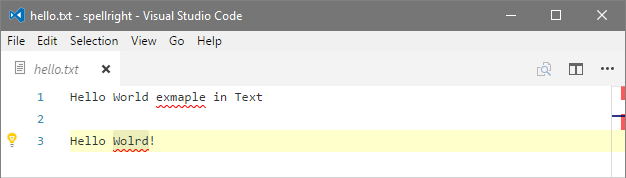
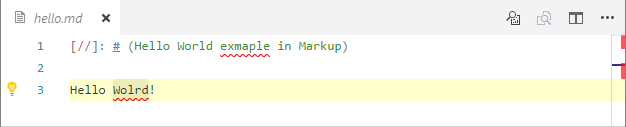
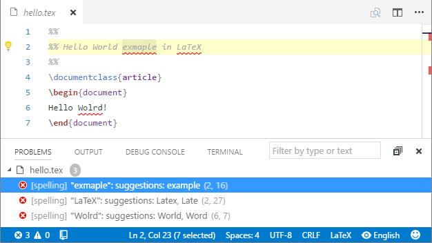
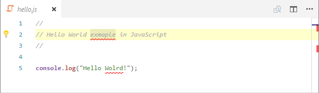
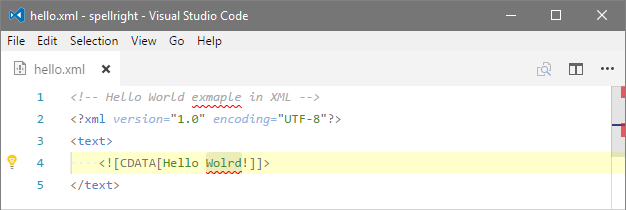

# Screenshots

## Plain Text Documents

Spell Right can spell check **plain text**:

**markdown**:

and **LaTeX** documents:

## Source Code Documents

It can also spell **comment**/**string** sections of most programming languages like **C++**:

**Python**:

**JavaScript**

or for example **Batch** scripts:

## XML/HTML Documents

Also it can spell comments/text/CDATA nodes of **XML**/**HTML** class documents:

## Language switching GUI

Extension has a handy list interface for switching spelling dictionary (language) or turning spelling OFF for currently open document type:

It can be reached by clicking on indicator field in status bar:

